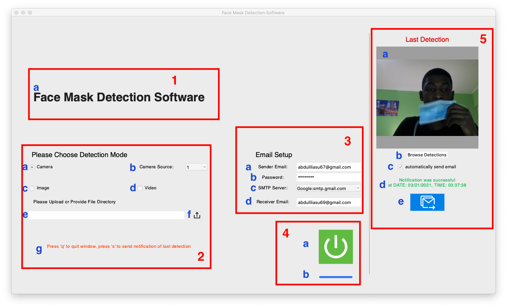

# Face-Mask-Detection

## A software for detecting people not wearing Covid-19 face mask.

Face Mask Detection Software was developed by Abdulrahim Iliyasu Illo, 2021.

## Installation
1. Download or clone the project from the GitHub Repository
2. Install Python 3.8 from [Python 3.8.0 Download](https://www.python.org/downloads/release/python-380/)
3. Open with any IDE of choice (e.g. pyCharm)
5. Set Python Interpreter as Python 3.8.0
6. Install all the necessary packages in control files if not installed.
7. Run main.py

```python
from view.interface import Interface

if __name__ == '__main__':
    main = Interface()
```

## How to use


Sections:

1.	Title Section
2.	Detection Mode Section
3.	Email Setup Section
4.	Control Section
5.	Detections Section

Components:

1)	Title Section (contains the title of the software).
a)	Software title
2)	Detection Mode Section (contains all detection mode setup).
a)	Camera detection mode radio button (chooses camera detection mode)
b)	Camera Source combo box (0,1,2,3 available only with camera detection mode)
c)	Image detection mode radio button (chooses image detection mode)
d)	Video detection mode radio button (chooses video detection mode)
e)	File path textbox (input available only in camera or video detection mode)
f)	Upload button (can be used instead of typing file path textbox)
g)	Info text label (shows information regarding the method of detection chosen after start-ing)
3)	Email Setup Section (contains all email setup fields).
a)	Sender email textbox (takes in sender’s email address)
b)	Password textbox (takes in sender’s email password)
c)	SMTP Server combo box (chooses sender’s email SMTP server e.g. Gmail [Google]) 
d)	Receiver Email (takes in notification receiver email address)
4)	Control Section (contains all control for running the software)
a)	Start Button (start detections based on detection mode)
b)	Progress bar (shows the progress of the program to the user)
5)	Detection Section (contains all controls and setup associated with detection)
a)	Last detection image frame (show the capture of the last detection made by the software)
b)	Browse Detection Button (show a folder containing all the captures made by the soft-ware)
c)	Auto send checkbox (automatically sends a notification when a capture is made)
d)	Notification status text (shows info about notification status)
e)	Send Email button (send an email using the capture displayed on [5a])


### Copyrights
© 2021
